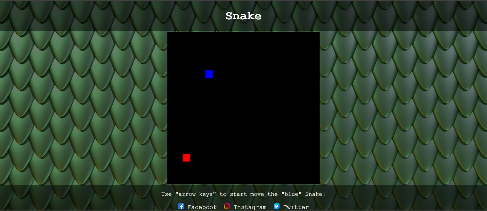

# Snake-Game

## Table of Contents
- [Introduction](#introduction)
- [Website goals](#website-goals)
- [Getting Started](#getting-started)
  - [Prerequisites](#prerequisites)
- [Game Instructions](#game-instructions)

# Introduction

+ Welcome to the Snake Game! This simple classic game allows you to control a snake and collect food to grow while avoiding collisions with the walls and yourself. This repository contains the code for the Snake Game implemented in HTML, CSS, and JavaScript.

# Website Goals

+ Easy to use for everyone that wants to play classic game

+ Very simple design so it will have a more "classic" fealing to it when playing

+ Make a person smile while playing this wonderful classic game

# Getting Started

## Prerequisites

Before you can run the game, you'll need a web browser that supports HTML5 and JavaScript.

